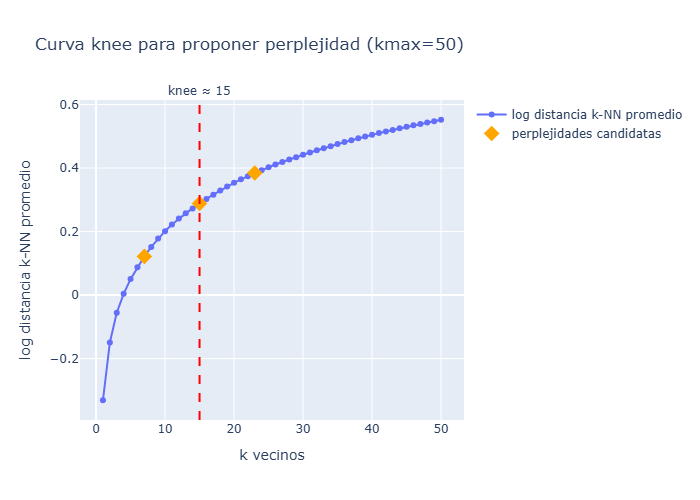

# Estudio sobre el Riesgo de Ataques Cardiacos
**Diplomado Ciencias de Datos — Generación 33 | FES Acatlán, UNAM**  
**Primer Examen — Marzo 2026**

---

## Descripción

Análisis de reducción de dimensiones aplicado a un dataset de biomarcadores cardiacos. El objetivo es proyectar los datos a 2D para identificar visualmente patrones que permitan distinguir pacientes con mayor probabilidad de sufrir un ataque cardiaco.

---

## Archivos

| Archivo | Descripción |
|---|---|
| `g33_m3ep1_JavierMartinezReyes_notebook.ipynb` | Notebook principal con todo el análisis |
| `HeartAttack.csv` | Dataset de 1,319 pacientes con 8 variables fisiológicas |
| `HeartAttack_Dict.csv` | Diccionario de variables |
| `X_mds_m.csv` | Proyección 2D resultante del MDS Métrico |
| `X_tsne.csv` | Proyección 2D resultante de t-SNE |
| `resultado_tsne.csv` | Pacientes clasificados como Alto Riesgo por t-SNE |

---

## Dataset

1,319 pacientes con las siguientes variables:

| Variable | Descripción | Unidad |
|---|---|---|
| `age` | Edad del paciente | años |
| `gender` | Género (1 = masculino) | binaria |
| `impluse` | Pulso | lpm |
| `pressurehight` | Presión arterial sistólica | mmHg |
| `pressurelow` | Presión arterial diastólica | mmHg |
| `glucose` | Nivel de glucosa en sangre | mg/dL |
| `kcm` | CK-MB (creatina quinasa) | biomarcador cardiaco |
| `troponin` | Troponina | biomarcador cardiaco |

---

## Estructura del Notebook

### Sección 0 — Configuración inicial
- Semilla de reproducibilidad: `random_seed = 333`
- Importación de librerías

### Sección 1 — Análisis Exploratorio de Datos (EDA)
- Carga del dataset y diccionario
- Estadísticas descriptivas
- Distribución de variables e histogramas
- Boxplots para detección de outliers
- Matriz de correlación
- **Limpieza de outliers:** capping con límites fisiológicos en `age`, `impluse`, `pressurehight` y `pressurelow`. Los biomarcadores `kcm` y `troponin` se dejan intactos — sus valores extremos son señal clínica, no ruido
- **Selección de features:** se excluye `gender` (variable binaria, distorsiona la geometría euclidiana de PCA); se incluyen las 7 variables continuas restantes


### Sección 2 — PCA
- Escalado z-score (`StandardScaler`)
- Scree plot con varianza explicada por componente
- Proyección a 2 componentes (PC1: 23.1%, PC2: 16.7%, Total: 39.8%)
- Loadings para interpretar qué variables dominan cada componente
- **Segmentación:** círculo de radio 2.5 centrado en el origen — pacientes fuera del círculo = Alto Riesgo
- Distribución comparativa de variables originales por grupo
- **Conclusión:** PCA no es óptimo aquí — la varianza está distribuida casi uniformemente entre las 7 componentes (matriz de correlación con valores cercanos a 0), lo que indica baja estructura lineal


### Sección 3 — MDS Métrico
- Proyección preservando distancias euclidianas del espacio original
- Cálculo de stress normalizado (criterio de Kruskal)
- Diagrama de Shepard para evaluar calidad de la proyección
- **Segmentación:** círculo con radio = percentil 90 de distancias al origen (top 10% = Alto Riesgo)
- **Conclusión:** varianza proyectada ~94% en 2D, pero stress elevado indica que las distancias originales no se preservan fielmente — consistente con la baja correlación entre variables


### Sección 4 — t-SNE
- Estimación de perplejidad óptima mediante curva k-NN (método del codo) → `perplexity = 15`
- Inicialización con PCA (`init='pca'`) para mayor estabilidad
- Métricas de calidad: divergencia KL y trustworthiness
- **Segmentación:** polígono definido manualmente sobre la proyección 2D — el interior del polígono corresponde a pacientes de Riesgo Bajo/Moderado; el exterior a Alto Riesgo
- Exportación de pacientes de Alto Riesgo con variables originales (`resultado_tsne.csv`)
- Distribución comparativa de variables originales por grupo
- **Conclusión:** t-SNE es el método más adecuado para este dataset por su capacidad de revelar clusters no lineales




---

## Reproducibilidad

```python
random_seed = 333
np.random.seed(random_seed)
```

Todos los modelos reciben `random_state=random_seed`. Los resultados son exactamente reproducibles con la misma versión de librerías.

### Versiones requeridas

```
python      >= 3.10
numpy
pandas
matplotlib
seaborn
scikit-learn
scipy
plotly
```

Instalar con:
```bash
pip install numpy pandas matplotlib seaborn scikit-learn scipy plotly
```

---

## Decisiones metodológicas clave

**¿Por qué capping y no eliminación de outliers?**  
Eliminar filas con valores extremos en `kcm` o `troponin` equivale a eliminar a los pacientes más enfermos — exactamente los de mayor interés para el análisis. El capping preserva todas las filas y solo corrige valores fisiológicamente imposibles en variables de medición.

**¿Por qué t-SNE sobre PCA para este dataset?**  
La matriz de correlación muestra que ningún par de variables (excepto `pressurehight`↔`pressurelow`, r=0.59) tiene correlación relevante. PCA solo comprime bien cuando hay correlaciones altas. Con variables casi independientes, el scree plot queda plano y las 2 primeras componentes capturan apenas el 39.8% de la varianza. t-SNE no depende de correlaciones lineales y encuentra estructura local que PCA aplana.

